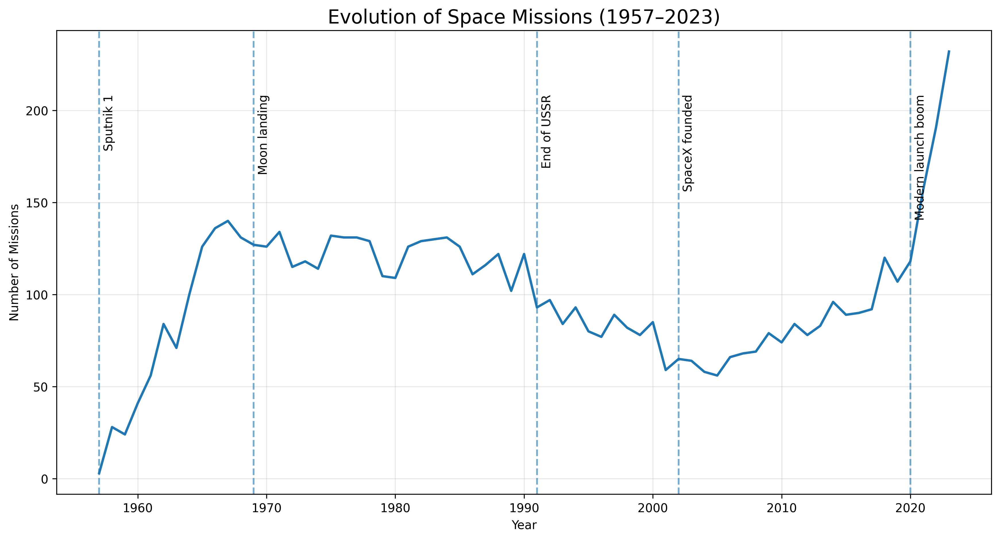
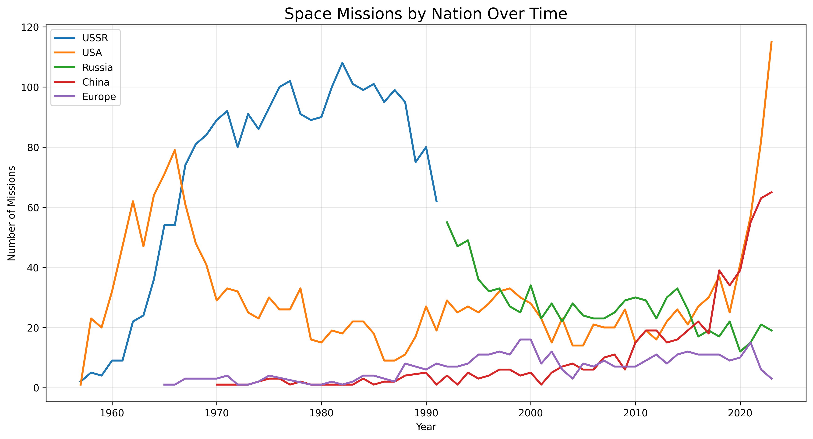
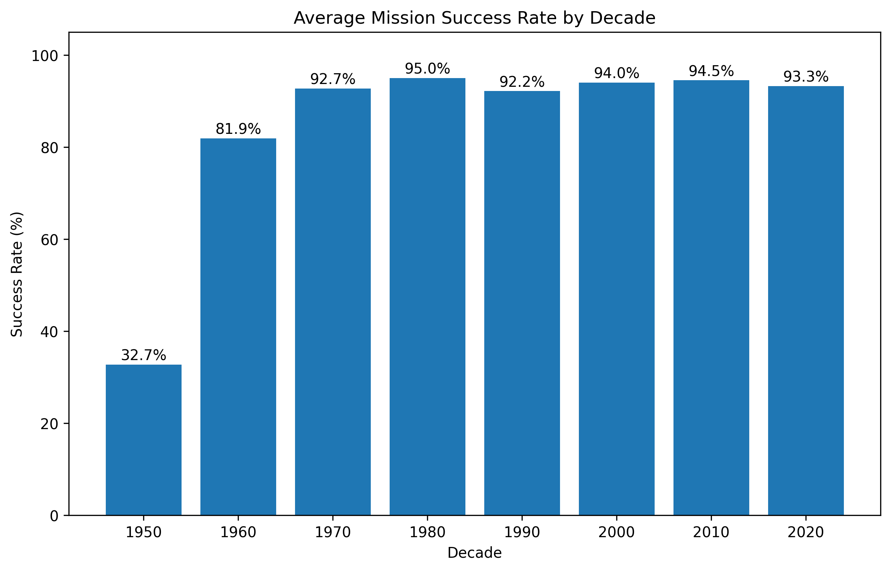
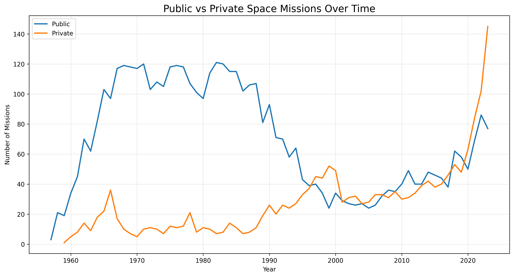
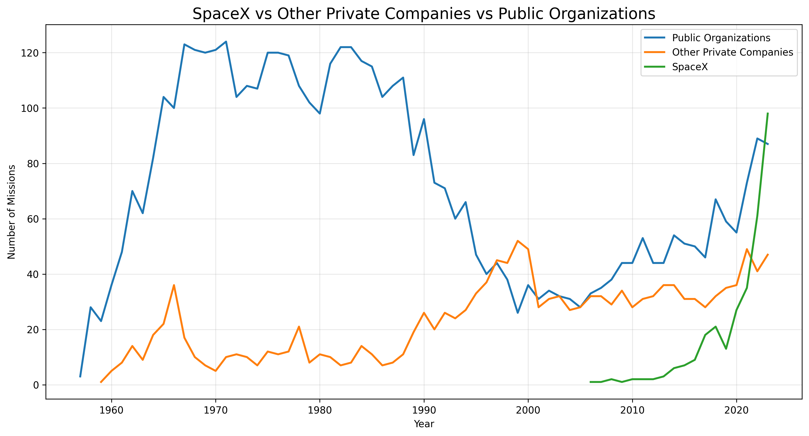

# The Evolution of Space Exploration (1957–2023)

## Project Overview

This project explores historical space-launch activity using a dataset of more than 6,700 missions.

The analysis focuses on:

- launch activity over time,
- shifts among major organization groups,
- recorded mission success rates,
- and the rise of private launch organizations.

## Tools

- Python
- Pandas
- Matplotlib
- Jupyter Notebook

## Dataset

The repository contains a local CSV snapshot with mission dates, organizations, launch locations, mission details, rocket status, and mission status.

The dataset includes records into early 2024. Because 2024 is incomplete in the snapshot, the analysis is restricted to **1957–2023**.

### Data provenance note

The exact original download URL/version for the CSV is not documented in the repository history. The column structure is consistent with datasets derived from historical launch listings such as the widely circulated “All Space Missions from 1957” datasets, but this project does **not** claim a specific original source without a verifiable record.

Before using the project as a formal research source, the dataset provenance should therefore be confirmed independently.

## Methodology

### Data preparation

- remove unused columns,
- extract launch-location country labels,
- parse launch dates,
- derive year and decade,
- exclude incomplete 2024 observations.

### Organization mappings

Two manually curated mappings are used for exploratory comparisons:

1. organization → broad national/regional group,
2. organization → simplified public/private classification.

Only mapped organizations are included in those comparisons. The notebook prints mapping coverage so that the excluded share is visible.

Public/private status can be institutionally and historically complex, so this classification is intentionally treated as an analytical simplification rather than an authoritative taxonomy.

## Research Questions

### 1. How has launch activity changed since 1957?



The dataset shows an early expansion during the Space Race, lower activity after the Cold War period, and strong growth in recent years. In this snapshot, 2023 has the highest annual mission count.

### 2. How did activity shift among selected organization groups?



The manually classified subset shows major changes in the organizations contributing to launch activity over time. Because the mapping is incomplete, this chart should not be interpreted as a complete ranking of national space programs.

### 3. How did recorded mission success rates change?



A mission is classified as successful when `Mission_Status == "Success"`; all other recorded outcomes are treated as non-successes.

Recorded success rates rise sharply in the early decades and remain high later in the dataset. This is descriptive and does not identify the engineering or operational causes of that change.

### 4. How did classified public and private launch activity change?



Within the manually classified subset, private launch organizations become increasingly prominent in recent years.

### Bonus: SpaceX within the classified subset



Within the classified organizations, SpaceX accounts for a large share of recent private launch activity.

## Reproducibility

Install dependencies:

```bash
python -m pip install -r requirements.txt
```

Then run:

```text
notebooks/space_missions_analysis.ipynb
```

The notebook uses project-relative paths and recreates the figures in `images/`.

## Project Structure

```text
space-exploration-analysis/
├── data/
│   └── all_space_mission_launches.csv
├── images/
├── notebooks/
│   └── space_missions_analysis.ipynb
├── requirements.txt
└── README.md
```

## Limitations

- 2024 is excluded because it is incomplete in the dataset snapshot.
- Dataset provenance is not fully documented and should be confirmed before research use.
- Country labels extracted from launch locations do not necessarily represent the organization operating the mission.
- National/regional and public/private comparisons rely on incomplete manually curated mappings.
- Public/private ownership can change over time and may not fit a simple binary classification.
- Mission types differ substantially, so mission counts do not measure mission complexity or strategic importance.
- The analysis is descriptive and does not establish causal historical explanations.

## Portfolio Value

The project demonstrates data cleaning, feature engineering, time-based aggregation, categorical mapping, visualization, data-quality awareness, and explicit treatment of analytical limitations.
